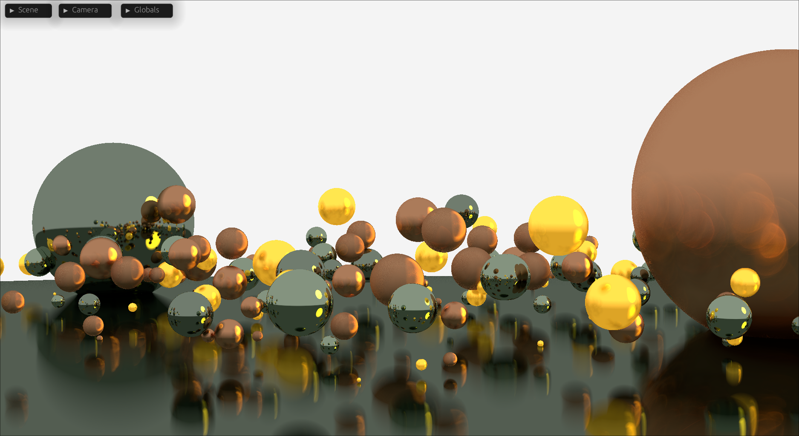
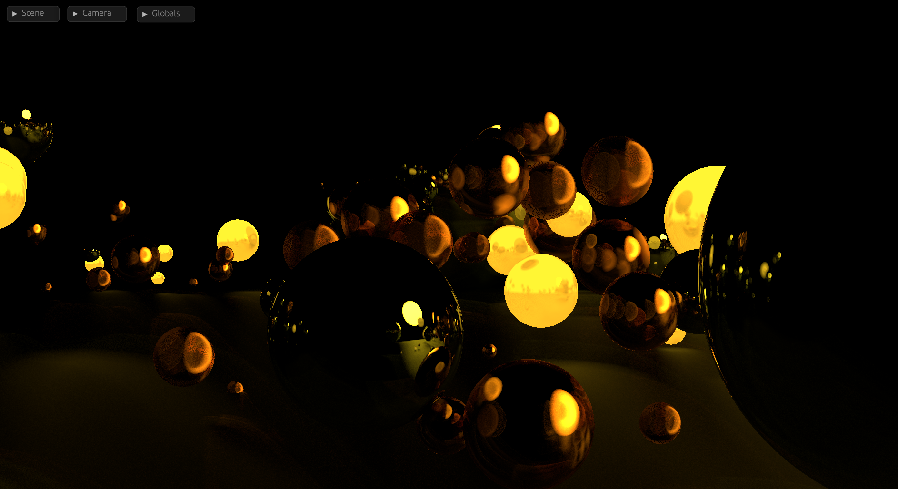

# Rays - A realtime gpu-raytracer for spheres.

A implementation of a sphere raytracer, running almost entirely on the gpu.

## Example scene

## Features
* Realtime rendering with a simple scene editor included; this means camera, materials, as well as the spheres are changable in real time.
* PBR based materials (though not even close to being complete)
* GPU driven raytracing, vastly increasing the performance in contrast to cpu-side rendering

## Resources
The implementation wouldn't have been possible without the following resources:
* A good beginner implementation [Ray Tracing in One Weekend](https://raytracing.github.io/books/RayTracingInOneWeekend.html) 
* The chernos raytracing code/series [found here](https://github.com/TheCherno/RayTracing)
* The well-known [GPU gems from nvidia](https://developer.nvidia.com/gpugems/gpugems)
